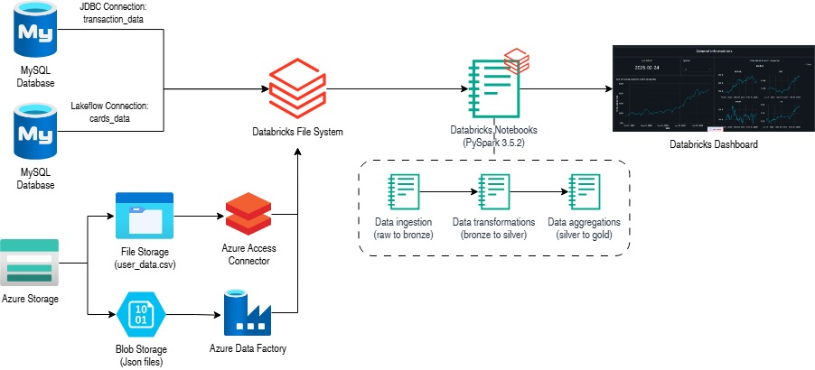
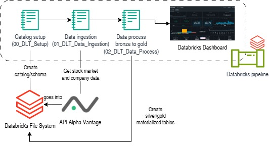

# Introduction
This project is a learning activity designed to practice PySpark, Databricks, and core data engineering concepts through the development of two distinct pipelines.

The first part of the project is implemented in three notebooks, available in the [ETL folder](./notebook/ETL/), and orchestrated with a Databricks pipeline. I built an ETL pipeline using the Medallion Architecture (Bronze/Silver/Gold) to process millions of transactional records with fraud indicators, from four different ingestion methods to a Databricks Dashboard. The data comes from a [Financial Transactions Dataset](https://www.kaggle.com/datasets/computingvictor/transactions-fraud-datasets), which includes transaction data, card information, merchant category codes, fraud labels (to determine whether a transaction is fraudulent or not), and user data. The analytics aim to detect fraud patterns (transaction types, merchants, users, etc.).

The second part of the project uses the Databricks ETL framework, Delta Live Tables ([DLT](./notebook/DLT/)), to ingest, process, validate data quality, and visualize stock market data. We collected data from the Alpha Vantage free API for four different symbols and processed it to create a dashboard to monitor their performance. This part is also implemented in three notebooks, orchestrated with a Databricks pipeline.
# Implementation
## ELT Implementation
### Architecture

### Dataset
Description from [Financial Transactions Dataset](https://www.kaggle.com/datasets/computingvictor/transactions-fraud-datasets)
#### Transaction Data (`transactions_data.csv`)
- Detailed transaction records including amounts, timestamps, and merchant details
- Covers transactions throughout the 2010s
- Features transaction types, amounts, and merchant information
- Perfect for analyzing spending patterns and building fraud detection models 
#### Card Information (`cards_dat.csv`) 
- Credit and debit card details
- Includes card limits, types, and activation dates
- Links to customer accounts via card_id
- Essential for understanding customer financial profiles
#### Merchant Category Codes (`mcc_codes.json`)
- Standard classification codes for business types
- Enables transaction categorization and spending analysis
- Industry-standard MCC codes with descriptions
#### Fraud Labels (`train_fraud_labels.json`)
- Binary classification labels for transactions
- Indicates fraudulent vs. legitimate transactions
- Ideal for training supervised fraud detection models
#### User Data (`users_data`)
- Demographic information about customers
- Account-related details
- Enables customer segmentation and personalized analysis
### Analytics
Using Databricks 16.4 LTS with Apache Spark 3.2, we performed analytics on millions of transactional records containing fraud indicators.

The objective was to identify fraud patterns and detect risky behaviors across users and merchants.

Some of the key analytical questions addressed were:

##### Which merchant categories exhibit the highest fraud rate?

We calculated the fraud rate per merchant category (fraudulent transactions divided by total transactions) to identify high-risk business segments.  
This helps detect structural fraud exposure in specific industries.

##### What are the total monetary losses due to fraud each day?

We aggregated fraudulent transaction amounts by day to measure financial impact and observe daily spikes.  
This metric helps quantify operational risk and potential revenue losses.

##### Are fraudulent transactions more common on high-value purchases compared to low-value purchases?

We compared fraud rates across transaction amount ranges to determine whether high-value transactions are more exposed to fraud.  
This analysis provides insight into fraud strategies and risk segmentation.

These analytics were implemented in the Gold layer to provide business-ready insights and were visualized through a Databricks Dashboard.

## DLT Implementation
### Architecture

### Dataset
For this project, we collected the data from the free Alpha Vantage API using the `TIME_SERIES_DAILY` and `OVERVIEW` (company information) functions.

For each company, we had:

#### Stock Market Data (`TIME_SERIES_DAILY`)
- Because we used the free version, the function returns the 100 latest data points, i.e., the stock market data (open, high, low, close, volume) of the last 100 trading days.
- It also returns metadata, such as the symbol, the last refreshed date, and the time zone.
- The data was ingested through API calls and stored in Bronze tables before being cleaned and transformed in the Silver and Gold layers following the Medallion Architecture.

#### Company Overview (`OVERVIEW`)
- Returns company information such as the name, sector, industry, and address.
- Returns financial indicators such as market capitalization, EBITDA, P/E ratio, and other key metrics.
- Returns analyst recommendations (Strong Buy, Buy, Hold, Sell, Strong Sell), which could be later aggregated into a sentiment score to visualize the overall analyst consensus.

### Analytics
Using the Medallion Architecture (Bronze / Silver / Gold) with the DLT Databricks framework, we built analytics-ready tables to monitor stock performance and company insights.
We chose NVIDIA, Lockheed Martin, Google and TotalEnergies.

The main analytics include:

- Company information overview (sector, industry, market capitalization, analyst consensus).
- Latest stock performance indicators (last open close, and daily variation).
- Weekly, monthly, and yearly price evolution using aggregated Gold tables.
- Weekly average trading volume to detect unusual market activity.
- Analyst results (Strong buy, buy, hold, sell, strong sell).

The final Dashboard allows users to monitor stock performance, compare multiple symbols, and evaluate analyst sentiment trends.

# Future Improvements

Because this project is more of a PoC, it still requires improvements.

- The final user requirements were not very clearly defined, especially for the DLT part. With more detailed requirements, we could:
    - Create Gold tables that are more business-focused and optimized for specific use cases.
    - Build a more accurate and purposeful dashboard, clearly aligned with what we want to visualize.
- The ETL part was developed on a premium Azure account, which can significantly increase the overall cost of the solution. We could optimize the infrastructure to reduce operational costs.
- To perform forecasting or more advanced analysis, either on the ETL or the DLT part, we could apply machine learning clustering techniques or leverage the Databricks MLflow API.