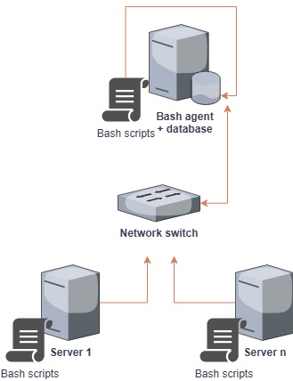

# Introduction
This project sets up a lightweight Linux monitoring agent that gathers hardware specifications and real-time usage metrics in a distributed environment, so you can keep an eye on your servers without having to htop every five minutes across your entire system. The project is designed for system administrators or DevOps engineers who need centralized visibility into their servers' performance. It uses Bash scripts to collect host information and real-time usage metrics, Git to facilitate teamwork and feature development, and Docker to run a PostgreSQL instance for a relational database. The collected data is automatically added to them using cron jobs, tracking CPU, memory, and disk usage for capacity planning, troubleshooting, or simply spying in a distributed system. Long story short, the project shows how to build a simple, efficient DevOps pipeline with just a few scripts and some container magic.

# Quick Start
```
# Start|Stop a PostgreSQL instance using psql_docker.sh
./scripts/psql_docker.sh start|stop

# Create tables using ddl.sql
psql -h hostname -U db_username -d db_name -f sql/ddl.sql

# Insert hardware specs data into the DB using host_info.sh
./scripts/host_info.sh hostname port db_name db_username db_user_password

# Insert hardware usage data into the DB using host_usage.sh
./scripts/host_usage.sh hostname port db_name db_username db_user_password

# Crontab setup (collect usage data every minute)
* * * * * bash /home/[absolut path]/host_usage.sh hostname port db_name db_username db_user_password &> /tmp/host_usage.log
```
> [!WARNING]
> Don't forget to create a PostgreSQL instance in a container and a database before using the scripts.

# Implementation
## Architecture


## Scripts
### psql_docker.sh
Manages the PostgreSQL container lifecycle: create, start, and stop.

**Usage**
```
# Create database
./psql_docker.sh create db_username db_password

# Start|Stop the container
./psql_docker.sh start|stop
```

### host_info.sh
Collects static hardware information: hostname, CPU, and memory details.

**Usage**
```
# Insert hardware specs data into the DB
# In this example, localhost is the hostname, 5432 is the port used
# host_agent the DB name, postgres the DB username
./scripts/host_info.sh localhost 5432 host_agent postgres db_user_password
```

### host_usage.sh
Collects real-time metrics: CPU, memory, and disk usage.

**Usage**
```
# Insert hardware usage data into the DB
# In this example, localhost is the hostname, 5432 is the port used
# host_agent the DB name, postgres the DB username
./scripts/host_usage.sh localhost 5432 host_agent postgres db_user_password
```

### crontab
Configure the crontab file to automate the execution of `host_usage.sh` every minute.

**Usage**
```
# Open the crontab file to edit it
crontab -e
# Add:
# In this example, localhost is the hostname, 5432 is the port used
# host_agent the DB name, postgres the DB username
* * * * * bash /home/[absolut path]/host_usage.sh localhost 5432 host_agent postgres db_user_password &> /tmp/host_usage.log
```

## Database Modeling
The system uses two tables in the `host_agent` database:
- `host_info` Table

| Column name      | Type      | Description                 |
|------------------|-----------|-----------------------------|
| id               | Serial    | Unique identifier           |
| hostname         | Varchar   | Linux system hostname       |
| cpu_number       | Int2      | Number of CPU cores         |
| cpu_architecture | Varchar   | CPU architecture type       |
| cpu_model        | Varchar   | CPU model name              |
| cpu_mhz          | Float8    | CPU frequency in MHz        |
| l2_cache         | Int4      | L2 cache capacity in kB     |
| timestamp        | Timestamp | Time when data was recorded |
| total_mem        | Int4      | Total memory in MB          |

- `host_usage` Table

| Column name    | Type      | Description                             |
|----------------|-----------|-----------------------------------------|
| timestamp      | Timestamp | Time of metric collection               |
| host_id        | Serial    | Unique identifier, FK ref. host_info.id |
| memory_free    | Int4      | Free memory in MB                       |
| cpu_idle       | Int2      | CPU idle mode usage in %                |
| cpu_kernel     | Int2      | CPU kernel mode usage in %              |
| disk_io        | Int4      | Reads and writes in progress            |
| disk_available | Int4      | Root directory available disk in MB     |

# Tests
- The **bash scripts** were tested manually on a Rocky Linux environment. Data entry was confirmed manually by checking all tables in the database.
  - `host_info.sh` has been tested by comparing the collected data with the results of commands such as `lscpu`, `hostname`, or `cat /proc/meminfo`.
  - `host_usage.sh` has been tested by comparing the collected data with the results of commands such as `vmstat` or `df -BM`.
- **DDL scripts** were manually tested using a psql connection to confirm table creation and data insertion.
- The **Cron job** was tested manually by checking the file created in `/tmp/host_usage.log` and the data entry in the `host_usage` table.

All tests have been successfully validated.

# Deployment
The application has been deployed with:
- **GitHub** for collaboration and feature addition;
- **Crontab** to automate the insertion of host usage data;
- **Docker** to host the PostgreSQL database in a container
- **Bash scripts** in each node of our distributed system

This deployment makes it easy to extend our application to other hosts by simply adding the scripts and cron jobs to them.

# Improvements
This application was implemented quickly and deserves some improvements if we want it to scale without breaking a keyboard. A few ideas:
* Adding handling for hardware updates, so the system notices when a machine suddenly decides to get an upgrade/downgrade;
* Automate project installation by automatically creating a container, database, and its tables;
* Implement an error handling process in case of failure, so that you don't have to rely only on the fact that there are no more insertions in your table;
* Add a dashboard to visually track the usage of all our machines.