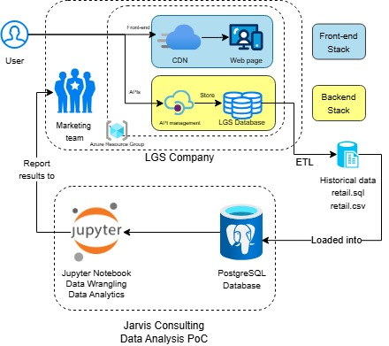

# Introduction
London Gift Shop (LGS) is an online retailer specialising in giftware, operating for over a decade. Despite its established presence, the company has seen its revenue stall in recent years. To reignite growth, LGS aims to better understand how its customers interact with their products and online store. The marketing team aims to leverage data-driven insights to design targeted campaigns, enhance customer retention, and capitalise on new opportunities.

To support this initiative, a PoC has been developed using historical transaction data provided by LGS. The goal is to transform raw sales records into actionable insights: purchasing patterns, seasonal trends, high-value customer behaviour, product performance, and more. These analytics will help the marketing team shape targeted email campaigns, promotional strategies, and customer engagement efforts based on real data rather than assumptions.

The project was built using accessible and flexible data tools, including:
- Python for data processing,
- Pandas/NumPy/Matplotlib for data manipulation and analysis,
- PostgreSQL to store the LGS's data report locally
- Jupyter Notebook to deploy the workflow and present results interactively,
- Docker to containerise PSQL and Jupyter servers and to connect them,
- Git for the version control,
- A lightweight ETL process included in the notebook to load, clean, and prepare the extracted dataset.

# Quick Start
```
# Create Docker containers for the PostgreSQL database and the Jupyter Notebook server
# Please define a PGPASSWORD first
docker run -d --name jrvs-psql -e POSTGRES_PASSWORD=$PGPASSWORD -v pgdata:/var/lib/postgresql/data -p 5432:5432 postgres:9.6-alpine
docker run -d --name jrvs-jupyter -p 8888:8888 -e JUPYTER_ENABLE_LAB=no -v "$PWD":/home/jovyan jupyter/datascience-notebook:python-3.8.5

# Start Docker containers
docker start jrvs-psql
docker start jrvs-jupyter

#Connect both Docker containers with the Docker network jarvis-net
docker network create jarvis-net
docker network connect jarvis-net jrvs-jupyter
docker network connect jarvis-net jrvs-psql

# Load data into your PSQL server
wget https://raw.githubusercontent.com/jarviscanada/jarvis_data_eng_demo/feature/data/python_data_wrangling/psql/retail.sql.
psql -h localhost -p 5432 -U postgres postgres -f retail.sql

# Get Jupyter notebook
wget https://raw.githubusercontent.com/jarviscanada/jarvis_data_eng_demo/feature/data/python_data_wrangling/ipynb/retail_data_wrangling_template.ipynb -O retail_data_analytics_wrangling.ipynb

# Get Jupyter token and launch the Notebook on your browser
docker logs jrvs-jupyter
```

# Implementation
## Project Architecture

LGS has a web app distributed to bring the server closer to the customer, who could be all around the globe. This web application has a backend connected via APIs, which stores all the transactions made in its Database.

The provided SQL and CSV files come from this database and are a view of transactions between 01/12/2009 and 09/12/2011. We loaded this file into Jarvis Consulting's PostgreSQL database. With a connection between both Docker containers, we can access them from the Jupyter notebook stored in the Jupyter server containerised by Docker.

This allows us to do Data wrangling and analysis to report results to LGS's Marketing team.


## Data Set Information
The LGS IT team provided transaction data between 01/12/2009 and 09/12/2011 into a SQL file. As part of the ETL process, they removed the client's confidential information.

| Column name  | Type      | Description                                                                                                                          |
|--------------|-----------|--------------------------------------------------------------------------------------------------------------------------------------|
| invoice_no   | Nominal   | 6-digit integral number uniquely assigned to each transaction. If this code starts with the letter 'C', it indicates a cancellation. |
| stock_code   | Nominal   | 5-digit integral number uniquely assigned to each distinct product.                                                                  |
| description  | Nominal   | Product (item) name.                                                                                                                 |
| quantity     | Numeric   | Quantities of each product (item) per transaction.                                                                                   |
| invoice_date | Numeric   | Day and time when a transaction was generated.                                                                                       |
| unit_price   | Numeric    | Product price per unit in sterling.                                                                                                  |
| customer_id  | Nominal      | 5-digit integral number uniquely assigned to each customer.                                                                          |
| country      | Nominal | Name of the country where a customer resides.                                                                                        |

## Data Wrangling and Analytics
- [Notebook for Data Wrangling and Analytics](./retail_data_analytics_wrangling.ipynb)
### Data wrangling
For this part, we essentially load the provided data into our database, check the null and the type obtained in the Pandas dataframe.

Then, all the transformations and aggregations have been made specially for each analysis.

### Data Analytics
#### Analyses
Several analyses provide broader business visibility:
- Total Invoice Amount Distribution: identifies spending patterns and anomalies.
- Monthly Placed vs. Cancelled Orders: highlights operational or seasonal issues.
- Monthly Sales & Sales Growth: tracks revenue trends and slowdowns.
- Monthly Active Users: measures customer engagement.
- New vs. Existing Users: shows acquisition vs. retention balance.

#### RFM Analysis Summary

To better understand customer behaviour, an RFM (Recency, Frequency, Monetary) model was built. This segmentation allowed us to identify high-value groups, inactive customers, and potential risks.

We focused on three strategic segments:
- **Champions** (856 customers):
    - Very frequent shoppers
    - Highest spending group
    - Recent activity

**Recommendation**: Maintain loyalty with exclusive offers, early access, and personalized product suggestions.

- **Can't Lose** (85 customers)
    - High spenders with strong past engagement
    - Now inactive for a long period

**Recommendation**: Reactivation campaigns with strong incentives (discounts, bundles, gift offers) and recommendations based on their previous purchases.

- **Hibernating** (1535 customers)
    - Long-inactive
    - Low-frequency buyers
    - Still a large segment with reactivation potential

**Recommendation**: Simple discount-driven or seasonal promotions to encourage a return purchase.

# Improvements
Although the current PoC demonstrates the potential of data analysis for LGS, several improvements could turn it into a more complete, scalable solution.

### Dashboard
- Build an interactive dashboard (e.g. Power BI, Tableau) to display key insights in real time.
- First from static data from PoC, then from a live pipeline connected to active sales data, allowing the marketing team to monitor customer behaviour continuously and react actively

### Conclusion and Actionable Insights
- Automatically highlight risks such as lost customers, declining product lines, or seasonal dependencies.
- Recommend actions to take, such as targeted promotions, optimised product bundles, or personalised outreach.

### Additional Analytics
- Incorporate predictive models using the latest data to forecast sales and stocks, identify risks, or estimate repeat purchase probability.
- Introduce advanced KPIs such as Customer Lifetime Value (CLV) or Customer Acquisition Cost (CAC) to help LGS allocate marketing efforts more effectively.

### Exiting the PoC and Delivering a Real Solution
To operationalise the project beyond the PoC stage, the following steps would be needed:
- Implement a robust data pipeline (ETL/ELT) to automatically ingest, clean, and transform data.
- Schedule recurring jobs to refresh analytics and update dashboards.
- Store data in a scalable platform such as a data warehouse or lake.
- Automate the generation of reports to support weekly and monthly marketing planning.

By implementing these improvements, LGS could transform this PoC into a fully integrated analytics solution that continuously supports marketing decisions and drives sustained revenue growth.