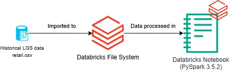
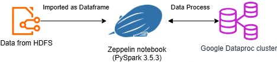

# Introduction
This project is a learning activity from the Jarvis Training Program designed to practice PySpark through the development of two distinct notebooks. Together, they cover core PySpark concepts such as querying data, data manipulation, and generating high-value business insights.

The first part of the project is implemented in a Zeppelin notebook, available [here](./notebook/WDI_Data_Analytics_2ME4UEY7U.zpln). This section focuses mainly on learning and experimentation. It involves querying a table imported into Zeppelin and comparing PySpark DataFrame operations with equivalent SQL queries. The Spark environment runs on a Google Dataproc cluster composed of three machines.

The second part of the project follows the [Python Data Analytics project](https://github.com/jarviscanada/jarvis_data_eng_AlexandreBellemin-Magninot/tree/master/python_data_analytics) and is based on a simulated retail dataset from London Gift Shop, an online boutique selling gift items. The business objective is to better understand customer behavior in order to design targeted marketing campaigns, improve customer retention, and identify high-value customers.

The original analysis was implemented using Pandas in a Jupyter notebook. The goal of this project was to rebuild and scale this analysis using PySpark, making it suitable for large datasets and distributed data processing environments. The work focuses on customer segmentation and behavioral analysis using RFM (Recency, Frequency, Monetary) metrics.

To achieve this, the Pandas-based notebook was migrated to a Databricks notebook running Spark 3.5.2. The implementation relies exclusively on structured APIs (DataFrame API), avoids Python UDFs, and reproduces the same customer behavior analysis and segmentation logic as the original Pandas version.

# Databricks Implementation
- Describe the dataset and your analytics work (make sure you create a link to your ipynb)
- Describe the architecture (e.g. Databricks, DBFS, Azure, Azure storage, Hive Metastore, PySpark, data flow, etc..)
- Draw an architecture diagram

### Dataset and analytics
The dataset contains transactional data for the London Gift Shop, including:
- Invoice number
- Customer identification number
- Product description
- Quantity of the product for this invoice
- Unit price of the product
- Transaction timestamps

Using PySpark on Databricks, the following work and analytics were performed:
- Data loading and cleaning 
- Customer-level aggregations
- RFM score computation (Recency, Frequency, Monetary)
- Customer segmentation using regex, according to the recency and frequency score
- Generation of business insights for marketing campaigns, mostly for Can't Lose, Champions and Hibernating segements.

The notebook is available here: [Databricks Notebook](https://github.com/jarviscanada/jarvis_data_eng_AlexandreBellemin-Magninot/tree/master/spark/notebook/Retail%20Data%20Analytics%20with%20PySpark.ipynb)

### Databricks Architecture
The Databricks implementation relies on a cloud-native Spark architecture:
- Databricks workspace for development and execution
- Data stored in cloud object storage (Azure Data Lake Storage)
- DBFS as an abstraction layer for data access
- PySpark for distributed processing and analytics

The data flow is the following:
1. Raw data (retail.csv) is loaded from cloud storage into Databricks tables
2. Data is cleaned and transformed using PySpark
3. Aggregations for analytics and RFM metrics are computed
4. Segmentation logic is applied
5. Results are stored or visualized for analysis

# Zeppelin Implementation
### Dataset and analytics
The Zeppelin part of the project was primarily a learning-oriented exercise. The dataset was created as a Hive external table stored in Parquet format and managed through the Hive Metastore. The table is available [here](https://raw.githubusercontent.com/jarviscanada/jarvis_data_eng_demo/feature/data/spark/data/wdi_csv_parquet.tar.gz).

This environment allowed me to practice querying Hive tables with Spark, comparing PySpark DataFrame operations with equivalent SQL queries, and understanding how Spark can process faster with the `pyspark.sql.functions`.

The dataset was a World Data Indicator from 2016, with:
- The name of the country
- The code of the country
- An indicator code to know what we are talking about
- The indicator name associated
- An indicator value

### Zeppelin Architecture
1. Data is loaded from a targz file
2. Spark processes the data using PySpark
3. Results are explored directly in Zeppelin

# Future Improvements
- To perform advanced analysis, we could apply ML clustering techniques or use Databricks MLFlow API.
- To automate the data flow, we could schedule pipelines using Airflow or Databricks Jobs
- Add automated validation and anomaly detection to ensure the data quality
- Finally, we could connect results to a BI tool (Power BI, Tableau) for business users